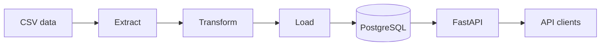

# CareerPulse AI

[](https://github.com/SNDLM/careerpulse-ai/actions/workflows/ci.yml)

Data engineering and analytics project for processing and exploring technology job-market data in Madrid.

CareerPulse AI implements an ETL pipeline, PostgreSQL persistence, a tested REST API and automated quality checks. Additional analytics, dashboards, cloud deployment and AI features are planned.

## Current features

- CSV job-data extraction.
- Data cleaning and technology-name normalization.
- Processed CSV generation.
- PostgreSQL storage with UPSERT operations.
- Environment-based database configuration.
- REST API built with FastAPI.
- Job filtering by technology, location and remote status.
- Aggregated salary and remote-work statistics.
- Automated tests with pytest.
- Code-quality checks with Ruff.
- Continuous integration with GitHub Actions.

## Architecture



## Technology stack

- Python 3.12
- FastAPI
- PostgreSQL
- Psycopg 3
- Pydantic
- pytest
- Ruff
- GitHub Actions

## Project structure

- `.github/workflows`: continuous-integration configuration.
- `data/raw`: original datasets.
- `data/processed`: transformed datasets.
- `docs`: project documentation.
- `notebooks`: exploratory data analysis.
- `src/careerpulse`: application source code.
- `tests`: automated tests and sample fixtures.

## API endpoints

| Method | Endpoint | Description |
|---|---|---|
| GET | `/health` | Check API availability |
| GET | `/jobs` | Return all job records |
| GET | `/jobs/{job_id}` | Return one job by ID |
| GET | `/stats/summary` | Return aggregated job-market statistics |

The `/jobs` endpoint accepts optional filters:

- `technology`
- `location`
- `remote`

Example:

```text
GET /jobs?technology=AWS&location=Madrid&remote=true
```

## Local installation

Clone the repository:

```powershell
git clone https://github.com/SNDLM/careerpulse-ai.git
cd careerpulse-ai
```

Create the virtual environment:

```powershell
py -3.12 -m venv .venv
```

Install the project and development dependencies:

```powershell
.\.venv\Scripts\python.exe -m pip install -e ".[dev]"
```

Create the local environment file:

```powershell
Copy-Item .env.example .env
```

Replace the placeholder values in `.env` with your local PostgreSQL configuration. The real `.env` file must never be committed.

## Running the API

```powershell
.\.venv\Scripts\python.exe -m uvicorn careerpulse.api:app --reload
```

Useful local addresses:

- API documentation: `http://127.0.0.1:8000/docs`
- Health check: `http://127.0.0.1:8000/health`
- Job records: `http://127.0.0.1:8000/jobs`
- Market summary: `http://127.0.0.1:8000/stats/summary`

## Quality checks

Run the automated tests:

```powershell
.\.venv\Scripts\python.exe -m pytest -v
```

Run the code-quality checks:

```powershell
.\.venv\Scripts\python.exe -m ruff check .
```

GitHub Actions automatically runs both checks on every push and pull request.

## Roadmap

- [x] Project structure and Python packaging
- [x] CSV extraction and transformation
- [x] Processed CSV generation
- [x] PostgreSQL integration
- [x] ETL pipeline
- [x] REST API
- [x] Filtering and summary statistics
- [x] Automated testing
- [x] Continuous integration
- [ ] Real job-source ingestion
- [ ] Exploratory analysis notebooks
- [ ] Interactive dashboard
- [ ] Docker containerization
- [ ] AWS deployment
- [ ] AI-assisted job-market insights

## Author

**Sergio Nieto de la Morena**

GitHub: [SNDLM](https://github.com/SNDLM)